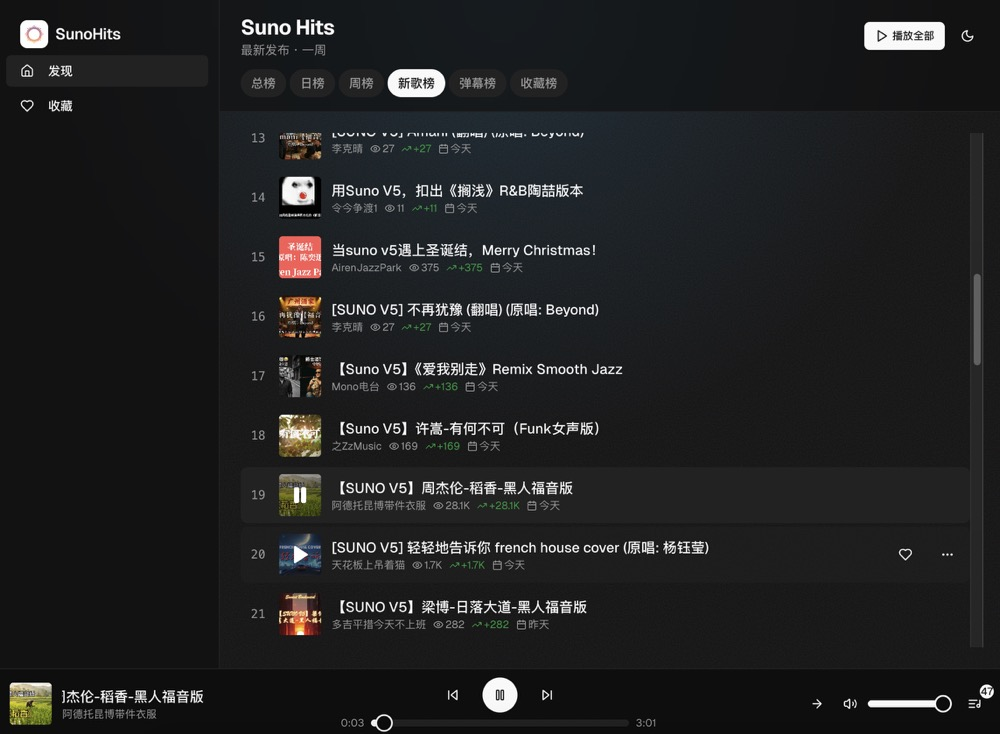
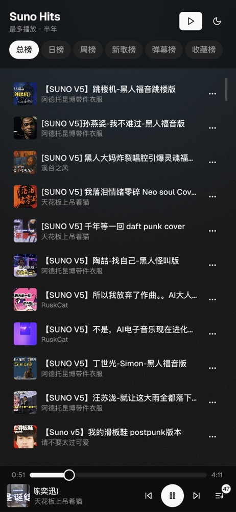

<p align="center">
  
</p>

<h1 align="center">SunoHits</h1>

<p align="center">
  <strong>B站 Suno AI 音乐排行榜</strong><br>
  发现热门 AI 生成音乐
</p>

<p align="center">
  <a href="https://sunohits.vercel.app"><strong>🔗 在线演示</strong></a> •
  <a href="#-一键部署">一键部署</a> •
  <a href="#-功能特性">功能特性</a> •
  <a href="#-技术栈">技术栈</a> •
  <a href="#-本地开发">本地开发</a>
</p>

---

## 📸 截图预览

<p align="center">
  
  
</p>

> ⚠️ **Demo 服务可能随时关闭**，建议自己部署以获得最佳体验。

---

## 🚀 一键部署

### 部署到 Vercel + Supabase

[](https://vercel.com/new/clone?repository-url=https%3A%2F%2Fgithub.com%2Fl1veIn%2Fsunohits&project-name=sunohits&repository-name=sunohits&demo-title=SunoHits&demo-description=AI%20Music%20Charts%20from%20Bilibili&integration-ids=oac_VqOgBHqhEoFTPzGkPd7L0iH6)

**部署步骤**：
1. 点击上方按钮，登录 Vercel
2. 创建或连接 Supabase 项目（Vercel 会自动引导）
3. 等待部署完成

### 数据库初始化

部署后，在 [Supabase SQL Editor](https://supabase.com/dashboard/project/_/sql) 运行：

```sql
-- 复制 sql/setup.sql 的全部内容并执行
```

### 添加环境变量

先生成一个随机密钥：
```bash
openssl rand -base64 32
```

**1. Vercel 项目设置** → Environment Variables：

| 变量名 | 值 | 说明 |
|--------|-----|------|
| `CRON_SECRET` | 刚生成的密钥 | API 验证请求用 |
    
**2. GitHub 仓库** → Settings → Secrets → Actions → Repository secrets：

| Secret 名 | 值 |
|-----------|-----|
| `CRON_SECRET` | **与 Vercel 相同的密钥** |
| `VERCEL_URL` | 你的部署地址（如 `https://sunohits.vercel.app`）|

> ⚠️ 两边的 `CRON_SECRET` 必须一致！GitHub Actions 用它调用 Vercel API。

### 自动爬取

GitHub Actions 会每 6 小时自动触发爬虫（免费！）。

也可以手动触发：GitHub → Actions → Crawl Charts → Run workflow

---

## ✨ 功能特性

### 📊 多榜单系统
- **总榜** - 半年内播放量最高 (Top 200)
- **日榜** - 24小时内播放量最高
- **周榜** - 一周内播放量最高
- **新歌榜** - 一周内最新发布
- **弹幕榜** - 半年内弹幕数最多
- **收藏榜** - 半年内收藏数最多

### 🎧 完整播放器
- 播放/暂停、上一首/下一首
- 进度条拖拽
- 音量控制、播放模式（顺序/随机/单曲/列表循环）
- 播放列表抽屉
- 「播放全部」按钮
- 「清空列表」按钮

### 💾 本地存储功能
- **收藏夹** - 收藏喜欢的歌曲
- **屏蔽列表** - 屏蔽非音乐内容
- **播放列表持久化** - 刷新页面不丢失

### 📱 响应式设计
- 桌面端：侧边栏 + 播放器栏
- 移动端：底部标签 + 紧凑播放器

---

## 🛠 技术栈

- **框架**: Next.js 15 (App Router)
- **数据库**: Supabase (PostgreSQL)
- **样式**: Tailwind CSS + shadcn/ui
- **状态管理**: Zustand + localStorage
- **部署**: Vercel

---

## 📁 项目结构

```
sunohits/
├── app/
│   ├── api/
│   │   ├── charts/       # 榜单数据 API
│   │   ├── crawl/        # 爬虫触发器
│   │   └── play/         # 音频流代理
│   ├── favorites/        # 收藏页面
│   └── page.tsx          # 首页
├── components/
│   ├── layout/           # 侧边栏、移动端导航
│   ├── player/           # 播放器组件
│   └── song-list/        # 歌曲列表组件
├── lib/
│   ├── bili/             # B站客户端
│   ├── services/         # 爬虫服务
│   └── store/            # 状态管理
└── sql/
    └── setup.sql         # 数据库初始化
```

---

## 🧪 本地开发

```bash
# 安装依赖
npm install

# 启动开发服务器
npm run dev

# 运行测试
npm test

# 手动爬取数据
npx tsx scripts/run-crawl.ts
```

---

## � 致谢

本项目参考了以下优秀开源项目：

- [wood3n/biu](https://github.com/wood3n/biu) - B站音乐播放器
- [SocialSisterYi/bilibili-API-collect](https://github.com/SocialSisterYi/bilibili-API-collect) - B站 API 文档

---

## �📜 开源协议

MIT

---

<p align="center">为 AI 音乐爱好者用 ❤️ 打造</p>

